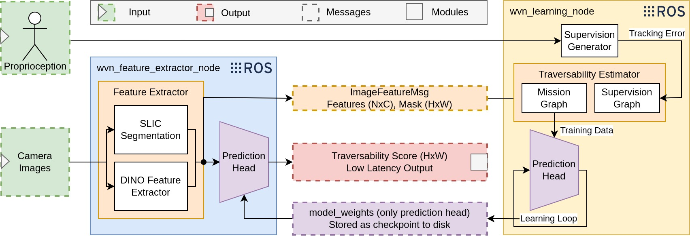

<h1 style="text-align: center;">Fast Traversability Estimation for Wild Visual Navigation</h1>

<p align="center">
  <a href="#citation">Citation</a> •
  <a href="#setup">Setup</a> •
  <a href="#experiments">Experiments</a> •
  <a href="#contributing">Contributing</a> •
  <a href="#credits">Credits</a>
  
  
</p>


 

## Citation

```
@INPROCEEDINGS{FreyMattamala23, 
    AUTHOR    = {Jonas Frey and Matias Mattamala and Nived Chebrolu and Cesar Cadena and Maurice Fallon and Marco Hutter}, 
    TITLE     = {{Fast Traversability Estimation for Wild Visual Navigation}}, 
    BOOKTITLE = {Proceedings of Robotics: Science and Systems}, 
    YEAR      = {2023}, 
    ADDRESS   = {Daegu, Republic of Korea}, 
    MONTH     = {June}, 
    DOI       = {TBD} 
} 
```
Checkout out also our other works.

 

## Setup
### Installation and Dependencies

1. Clone the repository.
```shell
mkdir ~/git && cd ~/git 
git clone git@github.com:leggedrobotics/wild_visual_navigation.git
```

2. Install the conda environment. (Currently the conda environment file is not tested and most likely outdated)
```shell
# Make sure to be in the base conda environment
cd ~/git/wild_visual_navigation
conda env create -f environment.yaml 
```

3. Install the wild_visual_navigation package.
```shell
conda activate wvn
cd ~/git
pip3 install -e ./wild_visual_navigation
```

### Configuration Overview
- The general configuration files can be found under: `wild_visual_navigation/cfg/experiment_params.py`
- This configuration is used in the `offline-model-training` and in the `online-ros` mode.
- When running the `online-ros` mode additional configurations for the individual nodes are defined in `wild_visual_navigation/cfg/ros_params.py`.
- These configuration file is filled based on the rosparameter-server during runtime.
- The default values for this configuration can be found under `wild_visual_navigation/wild_visual_navigation_ros/config/wild_visual_navigation`.
- We set an environment variable to automatically load the correct global paths and trigger some special behavior e.g. when training on a cluster.

#### [Optionally] Configure custom paths 
Set your custom global paths by defining the ENV_WORKSTATION_NAME and exporting the variable in your `~/.bashrc`.
  
  ```shell
  export ENV_WORKSTATION_NAME=your_workstation_name
  ```  
The paths can be specified by modifying `wild_visual_navigation/wild_visual_navigation/cfg/gloabl_params.py`. 
Add your desired global paths. 
Per default, all results are stored in `wild_visual_navigation/results`.

 


## Software Architecture Overview



 

## Experiments
### [Online] Ros-Mode
#### Setup
Let`s set up a new catkin_ws:
```shell
# Create Workspace
source /opt/ros/noetic/setup.bash
mkdir -r ~/catkin_ws/src && cd ~/catkin_ws/src
catkin init
catkin config --extend /opt/ros/noetic
catkin config --cmake-args -DCMAKE_BUILD_TYPE=RelWithDebInfo

# Clone Repos
git clone git@github.com:ANYbotics/anymal_c_simple_description.git
git clone git@github.com:IFL-CAMP/tf_bag.git
git clone git@github.com:ori-drs/procman_ros.git

# Symlink WVN
ln -s ~/git/wild_visual_navigation ~/catkin_ws/src

# Dependencies
rosdep install -ryi --from-paths . --ignore-src

# Build
cd ~/catkin_ws
catkin build anymal_c_simple_description
catkin build tf_bag
catkin build procman_ros
catkin build wild_visual_navigation_ros

# Source
source /opt/ros/noetic/setup.bash
source ~/catkin_ws/devel/setup.bash
```

After successfully building the ros workspace you can run the full pipeline by either using the launch file (this requires all packages to be installed into your system python installation), or by running the nodes from the conda environment as plain python scripts.
We are currently working on the instructions using a `virtualenv` which eases this process.

- Run WVN Nodes:
```shell
python wild_visual_navigation_ros/scripts/wvn_feature_extractor_node.py
```
```shell
python wild_visual_navigation_ros/scripts/wvn_learning_node.py
```

- (optionally) RVIZ:
```shell
roslaunch wild_visual_navigation_ros view.launch
```

- (replay only) Replay Rosbag:
```shell
rosrun  play --clock path_to_mission/*.bag
```


### [Offline] Model Training (Currently not tested)

#### Additional Dependencies
TODO

#### Dataset Generation

Sometimes it`s useful to just analyze the network training therefore we provide the tools to extract a dataset useful for learning from a given rosbag. 
In the following we explain how you can generate the dataset with the following structure: 
```
dataset_name
  split
    forest_train.txt
    forest_val.txt
    forest_test.txt
  day3
    date_time_mission_0_day_3
      features
        slic100_dino224_16
          center
            time_stamp.pt
            ...
          graph
            time_stamp.pt
            ...
          seg
            time_stamp.pt
            ...
        slic_sift
          ...
        ...
      image
        time_stamp.pt
        ...
      supervision_mask
        time_stamp.pt
        ...
```

1. Dataset is configured in **wild_visual_navigation/utils/dataset_info.py**
2. Run extract_images_and_labels.py (can be also done for multiple missions with **extract_all.py**)
   - Will at first merge all bags within the provided folders from dataset_info into bags containing the `_tf.bag` and other useful data `_wvn.bag`.
   - Steps blocking through the bag
   - Currently, this is done by storing a binary mask and images as .pt files (maybe change to png for storage)
3. Validate if images and labels are generated correctly with **validate_extract_images_and_labels.py**
   - This script will remove images if no label is available and the other way around
   - The stopping early times should be quite small within the seconds
4. Create lists with the training and train/val/test images: **create_train_val_test_lists.py**
5. Convert the correct `.pt` files to `.png` such that you can upload them for the test set to segments.ai **convert_test_images_for_labelling.py**
6. Label them online
7. Fetch the results using **download_bitmaps_from_segments_ai.py**
8. Extract the features segments and graph from the image **extract_features_for_dataset.py**


#### Training the Network
##### Training  
We provide scripts for training the network for a single run where a parameter configuration yaml-file can be passed to override the parameters configured within `cfg/experiments_params.py`.
Training from the final dataset.

`python3 scripts/train_gnn.py --exp=exp_forest.yaml`

##### Hyperparameter  
We also provide scripts to use optuna for hyperparameter-searching: 

`python3 scripts/train_optuna.py --exp=exp_forest.yaml`

Within the objective function you can easily adjust the trail parameter suggestions. 

##### Ablations
Finally, we categorize our ablations into `loss`, `network`, `feature`, `time_adaptation` and `knn_evaluation`.

##### `loss`, `network`, and `feature`
For `loss`, `network`, and `feature` we can simply run a training script and pass the correct keyword.
We provide the configurations for those experiments within the `cfg/exp/ablation` folder.
```
python3 scripts/ablation/training_ablation.py --ablation_type=network
```
After running the training the results are stored respectively in `scripts/ablations/<ablation_type>_ablation` as a pickle file. 
For each training run the trained network is evaluate on all testing scenes and the AUROC and ROC values are stored with respect to the hand labeled gt-labels and self-supervised supervision-labels. 
We provide a jupyter notebook to interpret the training results. 
```
python3 scripts/ablation/training_ablation_visu.ipynb
```

##### `time_adaptation`
For the `time_adaptation` run simply run:
```
python3 scripts/ablation/time_adaptation.py
```
and for visualization:
```
python3 scripts/ablation/time_adaptation_visu.py
```
done.

 


## Development and Deprecated Information 

### Replay Usage [Online]
We provide a launch file to start all required nodes for close-loop integration.
```shell
roslaunch wild_visual_navigation_ros replay_launch.launch
```
The launch file allows to toggle the individual modules on and off.
```xml
  <arg name="anymal_converter"  default="True"/>
  <arg name="anymal_rsl_launch" default="True"/>
  <arg name="debayer"           default="True"/>
  <arg name="rviz"              default="True"/>
  <arg name="elevation_mapping" default="True"/>
  <arg name="local_planner"     default="True"/>
```

- Run WVN Node:
```shell
python wild_visual_navigation_ros/scripts/wild_visual_navigation_node.py _mode:=default
```

- Replay Rosbag:
```shell
rosbag play --clock path_to_mission/*.bag
```

The code on main should be always stable and capable to run on a robot.
The code on develop should be used for development code and then tested on the robot and merged into main. 

### Code formatting
```shell
# for formatting
pip install black
black --line-length 120 .
# for checking lints
pip install flake8
flake8 .
```
Code format is checked on push.

### Testing
Introduction to [pytest](https://github.com/pluralsight/intro-to-pytest).
```shell
pytest
```
