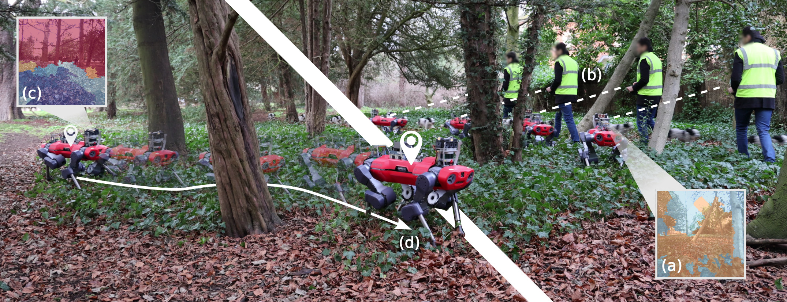
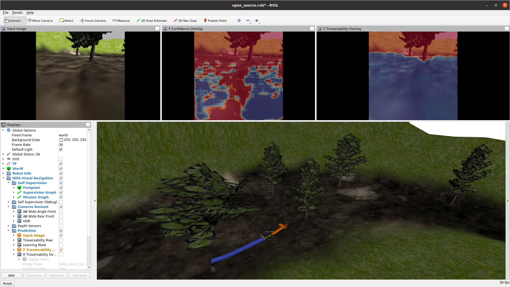

<h1 align="center">
  <br>
  Wild Visual Navigation
  <br>
</h1>
<p align="center">
  <a href="#features">Features</a> •
  <a href="#citing-this-work">Citing</a> •
  <a href="#quick-start">Quick Start</a> •
  <a href="#setup">Setup</a> •
  <a href="#demos">Demos</a>  •
  <a href="#development">Development</a>
</p>


<!-- [START BADGES] -->
<!-- Please keep comment here to allow auto update -->
<p align="center">
  <a href="[https://github.com/wow-actions/add-badges/blob/master/LICENSE"></a>
  <a href="https://github.com/leggedrobotics/wild_visual_navigation/actions/workflows/formatting.yml/badge.svg)"></a>
</p>
<!-- [END BADGES] -->




This package implements the Wild Visual Navigation (WVN) system presented in Frey & Mattamala et al. ["Fast Traversability Estimation for Wild Visual Navigation"](https://www.roboticsproceedings.org/rss19/p054.html) (2023) and later extended in Mattamala & Frey et al. ["Wild Visual Navigation: Fast Traversability Learning via Pre-Trained Models and Online Self-Supervision"](https://arxiv.org/abs/2404.07110) (2024). It implements a visual, self-supervised traversability estimation system for mobile robots, trained online after a few minutes of human demonstrations in the field.


 

## Features
- Implementation of the full WVN system in pure Python
- Quick start demos for online training in simulation, as well as scripts for inference using pre-trained models
- Robot integration packages for ANYmal and Jackal robots using ROS 1
- Integration into [`elevation_mapping_cupy`](https://github.com/leggedrobotics/elevation_mapping_cupy/tree/main)


 

## Citing this work
```bibtex
@INPROCEEDINGS{frey23fast, 
  AUTHOR    = {Jonas Frey AND Matias Mattamala AND Nived Chebrolu AND Cesar Cadena AND Maurice Fallon AND Marco Hutter}, 
  TITLE     = {{Fast Traversability Estimation for Wild Visual Navigation}}, 
  BOOKTITLE = {Proceedings of Robotics: Science and Systems}, 
  YEAR      = {2023}, 
  ADDRESS   = {Daegu, Republic of Korea}, 
  MONTH     = {July}, 
  DOI       = {10.15607/RSS.2023.XIX.054} 
} 
```

If you are also building up on the STEGO integration or using the pre-trained models for comparison, please cite:
```bibtex
@INPROCEEDINGS{mattamala24wild, 
  AUTHOR    = {Jonas Frey AND Matias Mattamala AND Libera Piotr AND Nived Chebrolu AND Cesar Cadena AND Georg Martius AND Marco Hutter AND Maurice Fallon}, 
  TITLE     = {{Wild Visual Navigation: Fast Traversability Learning via Pre-Trained Models and Online Self-Supervision}}, 
  BOOKTITLE = {under review for Autonomous Robots}, 
  YEAR      = {2024}
} 
```

If you are using the `elevation_mapping_cupy` integration:
```bibtex
@INPROCEEDINGS{erni23mem,
  AUTHOR={Erni, Gian and Frey, Jonas and Miki, Takahiro and Mattamala, Matias and Hutter, Marco},
  TITLE={{MEM: Multi-Modal Elevation Mapping for Robotics and Learning}}, 
  BOOKTITLE={2023 IEEE/RSJ International Conference on Intelligent Robots and Systems (IROS)}, 
  YEAR={2023},
  PAGES={11011-11018},
  DOI={10.1109/IROS55552.2023.10342108}
}
```

 

## Quick start
We prepared a quick-start demo using a simulated Jackal robot. The demo runs on Docker, so no system dependencies are required. Please check the full instructions [here](docker/README.md)




 

## Setup
We recommend following the aforementioned [Docker instructions](docker/README.md) as well as inspecting the [Dockerfile](docker/Dockerfile) for a clean, system-independent setup.

Otherwise, the next steps provide specific instructions to setup WVN on different systems.

### Requirements
The next steps assume you have the following hardware & software setup.
- ROS 1 Noetic
- CUDA-enabled GPU
- CUDA drivers (we use 12.0)

### Minimal setup
These are the minimum requirements to use the WVN scripts (no robot integration).

#### Installation
First clone the WVN and our STEGO reimplementation.
```shell
mkdir ~/git && cd ~/git 
git clone git@github.com:leggedrobotics/wild_visual_navigation.git
git clone git@github.com:leggedrobotics/self_supervised_segmentation.git
./self_supervised_segmentation/models/download_pretrained.sh
```

(Recommended) Create new virtual environment.
```shell
mkdir ~/.venv
python -m venv ~/venv/wvn
source ~/venv/wvn/bin/activate
```

Install the wild_visual_navigation package.
```shell
cd ~/git
pip3 install -e ./wild_visual_navigation
pip3 install -e ./self_supervised_segmentation
```

#### Execution
Please refer to the [Demos](#inference-of-pre-trained-model) section below.


### ROS setup
The following steps are required for a full installation, including the deployment tools. This enables the appropriate use of the ANYmal rosbags, enabling the robot model visualization and other deployment tools.

#### Installation
```shell
# Create new catkin workspace
source /opt/ros/noetic/setup.bash
mkdir -r ~/catkin_ws/src && cd ~/catkin_ws/src
catkin init
catkin config --extend /opt/ros/noetic
catkin config --cmake-args -DCMAKE_BUILD_TYPE=RelWithDebInfo

# Clone repos
git clone git@github.com:ANYbotics/anymal_d_simple_description.git
git clone git@github.com:ori-drs/procman_ros.git

# Symlink WVN-repository
ln -s ~/git/wild_visual_navigation ~/catkin_ws/src

# Dependencies
rosdep install -ryi --from-paths . --ignore-src

# Build
cd ~/catkin_ws
catkin build anymal_d_simple_description
catkin build wild_visual_navigation_ros

# Source
source /opt/ros/noetic/setup.bash
source ~/catkin_ws/devel/setup.bash
```

#### Execution
After successfully building the ROS workspace, you can run the entire pipeline by either using the launch file or by running the nodes individually.
Open multiple terminals and run the following commands:

- Run wild_visual_navigation
```shell
roslaunch wild_visual_navigation_ros wild_visual_navigation.launch
```

- (ANYmal replay only) Load ANYmal description for RViZ
```shell
roslaunch anymal_d_simple_description load.launch
```

- (ANYmal replay only) Replay Rosbag:
```shell
robag play --clock path_to_mission/*.bag
```

- RViz:
```shell
roslaunch wild_visual_navigation_ros view.launch
```

- Debugging (sometimes it is desirable to run the two nodes separately):
```shell
python wild_visual_navigation_ros/scripts/wvn_feature_extractor_node.py
```
```shell
python wild_visual_navigation_ros/scripts/wvn_learning_node.py
```

- The general configuration files can be found under: [`wild_visual_navigation/cfg/experiment_params.py`](wild_visual_navigation/cfg/experiment_params.py)
- This configuration is used in the `offline-model-training` and in the `online-ros` mode.
- When running the `online-ros` mode, additional configurations for the individual nodes are defined in [`wild_visual_navigation/cfg/ros_params.py`](wild_visual_navigation/cfg/ros_params.py).
- These configuration file is filled based on the ROS parameter server during runtime.
- The default values for this configuration can be found under [`wild_visual_navigation/wild_visual_navigation_ros/config/wild_visual_navigation/default.yaml`](wild_visual_navigation_ros/config/wild_visual_navigation/default.yaml).


 

## Demos

### Inference of pre-trained model
We provide the [`python3 quick_start.py`](quick_start.py) script to inference traversability from images within the input folder ([`assets/demo_data/*.png`](assets/demo_data)), given a pre-trained model checkpoint (`assets/checkpoints/model_name.pt`, you can obtain them from [Google Drive](https://drive.google.com/drive/folders/1v18a95u_s8s0870o3UZ8T-9xizsIZwSp?usp=share_link)). 
The script stores the result in the provided output folder (`results/demo_data/*.png`).

```python
python3 quick_start.py

# python3 quick_start.py --help for more CLI information
# usage: quick_start.py  [-h] [--model_name MODEL_NAME] [--input_image_folder INPUT_IMAGE_FOLDER]
#        [--output_folder_name OUTPUT_FOLDER_NAME] [--network_input_image_height NETWORK_INPUT_IMAGE_HEIGHT] 
#        [--network_input_image_width NETWORK_INPUT_IMAGE_WIDTH] [--segmentation_type {slic,grid,random,stego}]
#        [--feature_type {dino,dinov2,stego}] [--dino_patch_size {8,16}] [--dino_backbone {vit_small}]
#        [--slic_num_components SLIC_NUM_COMPONENTS] [--compute_confidence] [--no-compute_confidence]
#        [--prediction_per_pixel] [--no-prediction_per_pixel]
```

### Online adaptation from rosbags

To quickly test out the online training and adaption we provide some example rosbags ([GDrive](https://drive.google.com/drive/folders/1Rf2TRPT6auFxOpnV9-ZfVMjmsvdsrSD3?usp=sharing)), collected with our ANYmal D robot. These can be tested using the [ROS instructions](#execution)

Here we provide some examples for the different sequences:
<div align="center">

| MPI Outdoor | MPI Indoor | Bahnhofstrasse | Bike Trail |
|----------------|------------|-------------|---------------------|
|                 |             |              |                      |
|                 |             |              |                      |

</div>


 

## Development
Lastly, we provide some general guidelines for development. These could be useful to test WVN with your own robot platform.

### Repository structure
The WVN repo is structured in different folders, which we explain in the following figure:

```sh
📦wild_visual_navigation  
 ┣ 📂assets
     ┣ 📂demo_data                            # Example images
        ┣ 🖼 example_images.png
        ┗ ....
     ┗ 📂checkpoints                          # Pre-trained model checkpoints (must be downloaded from Google Drive)
        ┣ 📜 mountain_bike_trail_v2.pt
        ┗ ....
 ┣ 📂docker                                   # Quick start docker container
 ┣ 📂results   
 ┣ 📂test   
 ┣ 📂wild_visual_navigation                   # Core, ROS-independent implementation of WVN
 ┣ 📂wild_visual_navigation_anymal            # ROS1 ANYmal helper package 
 ┣ 📂wild_visual_navigation_jackal            # ROS1 Jackal simulation example
 ┣ 📂wild_visual_navigation_msgs              # ROS1 message definitions
 ┣ 📂wild_visual_navigation_ros               # ROS1 nodes for running WVN 
    ┗ 📂scripts                               
       ┗ 📜 wvn_feature_extractor_node.py     # Main process for feature extraction and inference
       ┗ 📜 wvn_learning_node.py              # Main process that generates supervision signals and the online training loop
 ┗ 📜 quick_start.py                          # Inference demo from pre-trained checkpoints
```

### Adapting WVN for your own robot
We recommend making a new ROS package to implement the overlays to run WVN with your own robot platform. We suggest inspecting the [wild_visual_navigation_jackal](wild_visual_navigation_jackal) as a reference.

In a nutshell, you need to configure:

- [wild_visual_navigation_jackal/config/wild_visual_navigation/camera.yaml](wild_visual_navigation_jackal/config/wild_visual_navigation/camera.yaml): This specifies the main parameters of the cameras available in your robot. Particularly if you plan to use them for training and inference, or just inference. You can also specify a weight that controls the time allocation of the camera scheduler.
- [wild_visual_navigation_jackal/config/wild_visual_navigation/jackal.yaml](wild_visual_navigation_jackal/config/wild_visual_navigation/jackal.yaml): This specifies the WVN parameters, as well as the robot input signals and frames. We recommend changing the frames accordingly, but implement a _converter_ node for the input signals (robot velocity and human command velocity, see below).
- [wild_visual_navigation_jackal/scripts/jackal_state_converter_node.py](wild_visual_navigation_jackal/scripts/jackal_state_converter_node.py): This script implements a node that re-maps the velocity estimates and velocity commands using custom WVN messages. We adopted this approach to avoid the installation of custom robot messages on the GPU computer where we ran WVN, and instead running the converter on the robot computer to obtain the signals we required.
- [wild_visual_navigation_jackal/launch/wild_visual_navigation.launch](wild_visual_navigation_jackal/launch/wild_visual_navigation.launch): A launchfile that loads the custom parameters of the package as well as launches the WVN nodes.

### Further notes
<details>
<summary>Here we provide additional details if you want to contribute.</summary>

#### Install pre-commit
```shell
pip3 install pre-commit
cd wild_visual_navigation && python3 -m pre_commit install
cd wild_visual_navigation && python3 -m pre_commit run
```

#### Code formatting
```shell
# for formatting
pip install black
black --line-length 120 .
# for checking lints
pip install flake8
flake8 .
```
Code format is checked on push.

#### Testing
Introduction to [pytest](https://github.com/pluralsight/intro-to-pytest).
```shell
pytest
```

#### Open-sourcing
Generating headers
```shell
pip3 install addheader

# If your are using zsh otherwise remove \
addheader wild_visual_navigation -t header.txt -p \*.py --sep-len 79 --comment='#' --sep=' '
addheader wild_visual_navigation_ros -t header.txt -p \*.py -sep-len 79 --comment='#' --sep=' '
addheader wild_visual_navigation_anymal -t header.txt -p \*.py --sep-len 79 --comment='#' --sep=' '

addheader wild_visual_navigation_ros -t header.txt -p \*CMakeLists.txt --sep-len 79 --comment='#' --sep=' '
addheader wild_visual_navigation_anymal -t header.txt -p \*.py -p \*CMakeLists.txt --sep-len 79 --comment='#' --sep=' '
```

#### Releasing ANYmal data
```shell
rosrun procman_ros sheriff -l ~/git/wild_visual_navigation/wild_visual_navigation_anymal/config/procman/record_rosbags.pmd --start-roscore 
```

```shell
rosbag_play --tf --sem --flp --wvn  mission/*.bag
```
</details>
