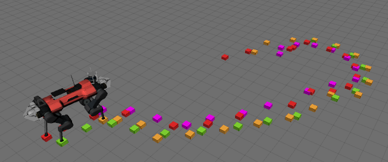

# footcontact_history




## Description
Analyses the swingcycle of each foot to estimate footholds and publishes the contact points as Pointcloud2 messages.


## Build

```
catkin build footcontact_history
```

## Launch

```
roslaunch footcontact_history all_feet.launch
```